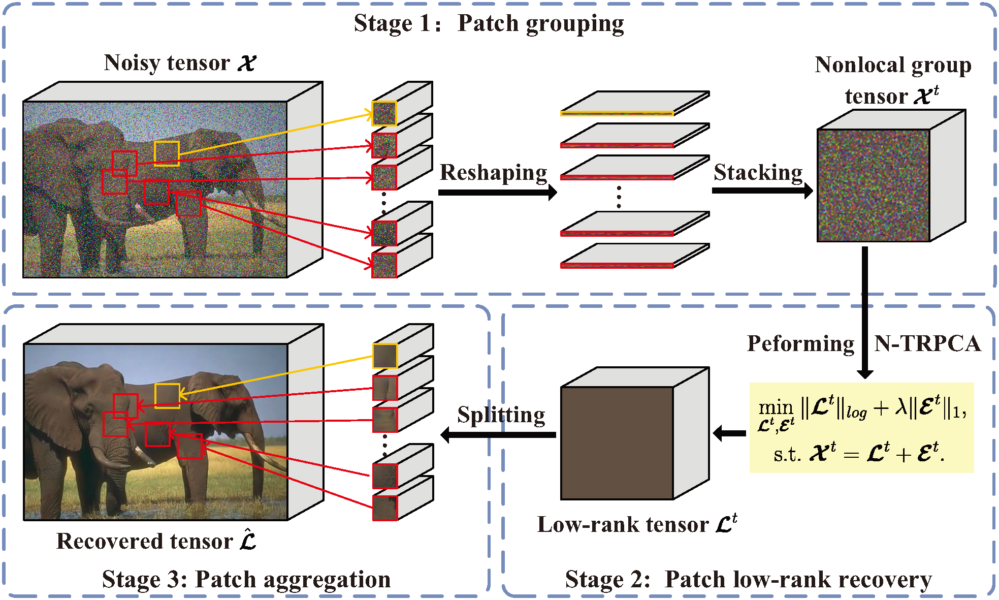

# Nonconvex & Nonlocal TRPCA

This is a demo for the following paper

X. Geng, Q. Guo, and C. Zhang, [Color image denoising via tensor robust PCA with nonconvex and nonlocal regularization](https://dl.acm.org/doi/10.1145/3469877.3493592), In *ACM Multimedia Asia (MMAsia'21)*, December 1-3, 2021. 

Full Version

X. Geng, Q. Guo, S. Hui, M. Yang, and C. Zhang, [Tensor robust PCA with nonconvex and nonlocal regularization](https://arxiv.org/abs/2211.02404), arXiv:2211.02404, 2022.

# Flowchart

